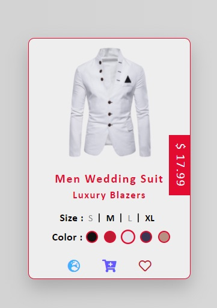

<h2 align="center">Mens Wedding Blazer Product UI</h2>
<div align="center" width="100%">
<code></code>
<code></code>
<code></code>
<code></code>
</div>

<p align="center">An awesome product UI with smooth hover effect and clickable color with product color changing effect.</p>
<br>

<div align="center" width="100%">

[![Contributors][contributors-shield]][contributors-url]
[![Forks][forks-shield]][forks-url]
[![Stargazers][stars-shield]][stars-url]
[![Issues][issues-shield]][issues-url]
[![MIT License][license-shield]][license-url]
<br>

[![Live Server][live-server-shield]][live-server]
[![Live Sass][live-sass-shield]][live-sass]
[![Bracket Pair Colorizer][bracket-pair-shield]][bracket-pair]
</div>

<!-- TABLE OF CONTENTS -->
## Table of Contents

* [About the Project](#about-the-project)
  * [Built With](#built-with)
* [Getting Started](#getting-started)
  * [Prerequisites](#prerequisites)
  * [Installation](#installation)
* [Usage](#usage)
* [Contributing](#contributing)
* [License](#license)
* [Contact](#contact)
* [Acknowledgements](#acknowledgements)


<!-- ABOUT THE PROJECT -->
## About The Project

[![Product Dashboard Screen Shot][product-screenshot]](https://example.com)


The project is about how to create a Product Card UI page with html, css/scss & js. This Product Card has wedding blazer with price & some sizes, colors & icons. An Hover Effect is triggered when mouse moves on card as shown in above image. After triggered effect, Card shows price, size, colors & some icons.

### Built With

This Project is build with Html, Css/Scss & Javascript. For icons, We use **_FontAwesome_** that provides us with some cool icons.
If u want to learn more about Html, Css/Scss & Javascript below are some links given.
Here are a few examples.
* [Learn HTML](https://www.w3schools.com/html/)
* [Learn CSS](https://www.w3schools.com/css/)
* [Learn Sass](https://www.w3schools.com/sass/)
* [Learn Javascript](https://www.w3schools.com/js/)
* [FontAwesome](https://fontawesome.com/)

<!-- GETTING STARTED -->
## Getting Started

Now we setup our environment for project locally.
To setup this project locally, follow this steps:


### Prerequisites

Here, are some software & plugins required that enhance our performance for project.

* [Visual Studio Code][vs-code].

    This is text editor that we require for our project. You can use any text editor but I prefer Visual Studio Code as enhances & reduces our workload.

***Vscode Plugins required for Our Project***

* [Live Server][live-server].

    This plugin simply reloads the page when we save the porject. We don't need to refresh page on browser.

* [Live Sass Compiler][live-sass].

    This plugin simply compiles our sass files & reduces our work. It creates css & css.map files.

* [Bracket Pair Colorizer][bracket-pair].

    This plugin colorizers our bracket on element we are styling in stylesheet/css file.

### Installation

1. Copy downloaded project & Paste to desired drive/directory.
1. Install [Visual Studio Code][vs-code].
1. Open our project folder.
1. Right-click on folder & Click on Open With Code.
1. Open index.html file
1. link stylesheet file from `sass/style.css` by using 

    ```
    <link rel="stylesheet" href="sass/style.css">
    ```
    >`Note: Don't link style.scss file bcoz browser can't read .scss file.`
1. Add FontAwesome cdn link to `index.html` file by using 

    ```
    <link rel="stylesheet" href="https://use.fontawesome.com/releases/v5.13.1/css/all.css">
    ```
1. link javascript file to `index.html` by using

    ```
    <script src="app.js"></script>
    ```
    >`Note: I name app.js but U can prefer any name to .js file.`
1. Type code in desired file or just copy & paste.
1. Start Live Server from bottom-left corner option.
1. Start Live Sass Compiler from bottom-center option.
1. Now, Project runs successfully on your browser.

<!-- USAGE EXAMPLES -->
## Usage

Below images will provide usage of our page.

<div align="center" width="100%">


</div>
<div align="center" width="100%">


</div>
<div align="center" width="100%">


</div>

<!-- CONTRIBUTING -->
## Contributing

Contributions are what make the open source community such an amazing place to be learn, inspire, and create. Any contributions you make are **greatly appreciated**.

* Fork the [Project][fork].
>    *`OR`*
* Please read [CONTRIBUTING][contributing], for details on our code of conduct, and the process for submitting pull requests to us.


<!-- LICENSE -->
## License

Distributed under the MIT License. See [***`LICENSE`***][license-url] for more information.

<!-- CONTACT -->
## Contact

* [*Twitter*](https://twitter.com/devil_2708)
* [*Gmail*](sahilthakur376@gmail.com)


<!-- ACKNOWLEDGEMENTS -->
## Acknowledgements
* [GitHub Emoji Cheat Sheet](https://www.webpagefx.com/tools/emoji-cheat-sheet)
* [Img Shields](https://shields.io)
* [Choose an Open Source License](https://choosealicense.com)
* [Font Awesome](https://fontawesome.com)
* [W3school](https://www.w3schools.com/)


<!-- MARKDOWN LINKS & IMAGES -->
<!-- https://www.markdownguide.org/basic-syntax/#reference-style-links -->
[contributors-shield]: https://img.shields.io/github/contributors/DevilStudio27/wedding-blazer-product-ui?logo=github&logoColor=cyan&style=flat-square
[contributors-url]: https://github.com/DevilStudio27/wedding-blazer-product-ui/graphs/contributors
[forks-shield]: https://img.shields.io/github/forks/devilstudio27/wedding-blazer-product-ui?label=Forks&logo=github&logoColor=cyan&style=flat-square
[forks-url]: https://github.com/DevilStudio27/wedding-blazer-product-ui/network/members
[stars-shield]: https://img.shields.io/github/stars/devilstudio27/wedding-blazer-product-ui?logo=github&logoColor=cyan&style=flat-square
[stars-url]: https://github.com/DevilStudio27/wedding-blazer-product-ui/stargazers
[issues-shield]: https://img.shields.io/github/issues/devilstudio27/wedding-blazer-product-ui?logo=github&logoColor=cyan&style=flat-square
[issues-url]: https://github.com/DevilStudio27/wedding-blazer-product-ui/issues
[license-shield]: https://img.shields.io/github/license/devilstudio27/wedding-blazer-product-ui?logo=github&logoColor=cyan&style=flat-square
[license-url]: https://github.com/DevilStudio27/wedding-blazer-product-ui/blob/master/LICENSE


[product-screenshot]: screenshots/Dashboard.jpg

[contributing]:https://github.com/DevilStudio27/wedding-blazer-product-ui/graphs/contributors
[fork]:https://github.com/DevilStudio27/wedding-blazer-product-ui/network/members

[vs-code]:https://code.visualstudio.com/
[live-server-shield]:https://img.shields.io/visual-studio-marketplace/i/ritwickdey.liveserver?label=Live%20Server&logo=visual-studio-code&logoColor=cyan&style=flat-square
[live-server]:https://marketplace.visualstudio.com/items?itemName=ritwickdey.LiveServer
[live-sass-shield]:https://img.shields.io/visual-studio-marketplace/i/ritwickdey.live-sass?label=Live%20Sass&logo=visual-studio-code&logoColor=cyan&style=flat-square
[live-sass]:https://marketplace.visualstudio.com/items?itemName=ritwickdey.live-sass
[bracket-pair-shield]:https://img.shields.io/visual-studio-marketplace/i/coenraads.bracket-pair-colorizer-2?label=Bracket%20Pair%20Colorizer%202&logo=visual-studio-code&logoColor=cyan&style=flat-square
[bracket-pair]:https://marketplace.visualstudio.com/items?itemName=CoenraadS.bracket-pair-colorizer-2
